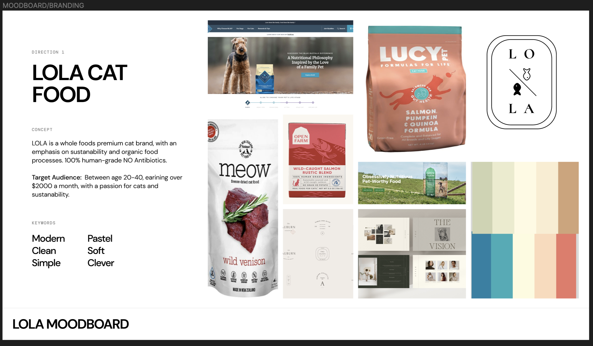
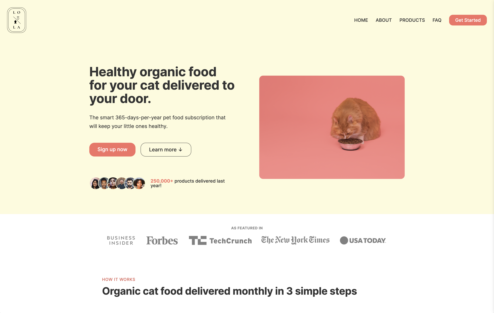
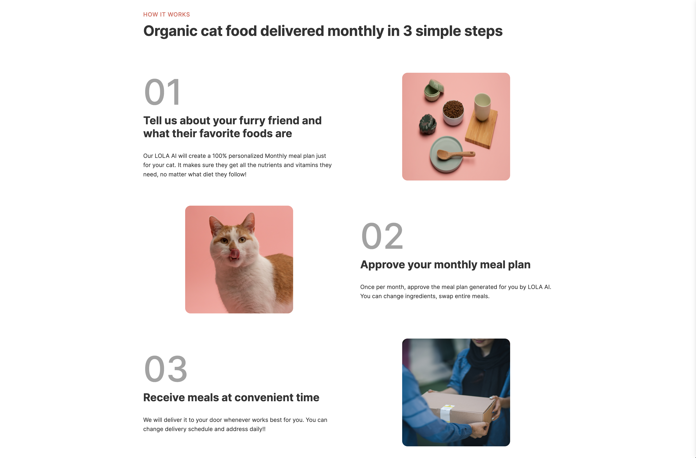
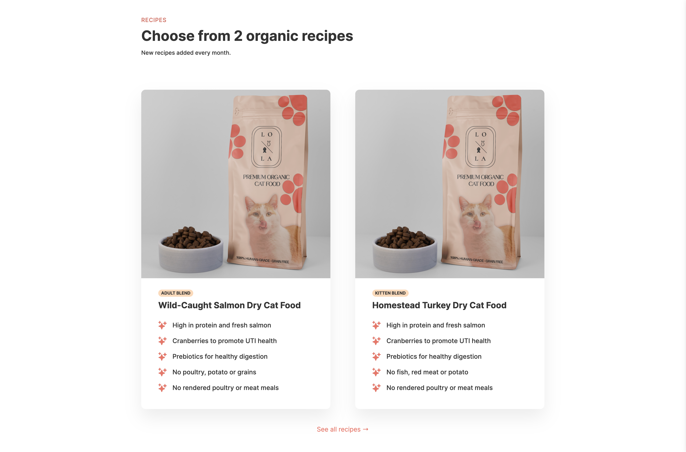

# 🐈 Cat Food Mock-site Project 🐈

### This is a mock cat food landing page site project done in pure HTML and CSS.

## 💻 Technologies Used 💻
### FIGMA - PHOTOSHOP - HTML - CSS

#### This project was made for learning and educational purposes only, taking inspiration from other well known cat food brands.
